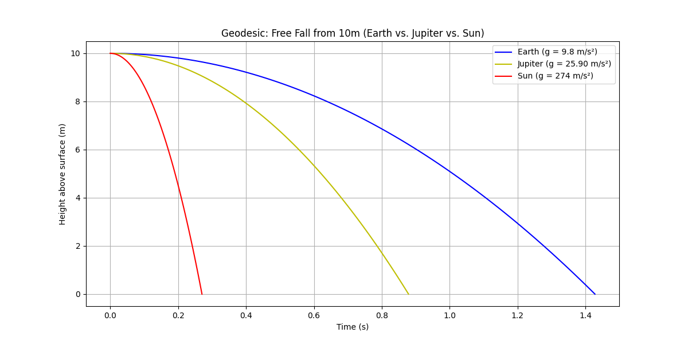

# Geodesic Motion: I. A Falling Object Near Earth

We’ll break down the geodesic equation in General Relativity (GR) for a falling object near Earth, connect it to Newtonian physics, and show how spacetime curvature explains gravity.

A **geodesic** is the shortest path between two points on a curved surface. Think of it as nature's way of finding the most efficient route when you can't travel in a straight line.
On a flat piece of paper, the geodesic is just a straight line. But on a sphere like Earth, geodesics are great circles - like the equator or any circle that cuts the planet in half. That's why airplanes fly along curved paths on maps - they're following geodesics to save fuel and time.

Let's think about falling from a treehouse to understand geodesics. When we drop a ball from our treehouse, it follows what appears to be a straight path downward. But this path is actually a geodesic!
The ball isn't following a straight line in the traditional sense - it's following the shortest possible path through curved spacetime. Earth's mass curves the spacetime around it, creating a geodesic that directs objects toward the ground.
This explains something that puzzled scientists for centuries: why do all objects fall at the same rate regardless of their mass? If you drop a heavy rock and a light tennis ball from the treehouse (ignoring air resistance), they hit the ground at the same time. That's because they're not being 'pulled' by a force that depends on their mass - they're simply following the same geodesic path through curved spacetime.

Einstein's insight was revolutionary - gravity isn't a force pulling objects down from the treehouse; it's the natural motion of objects following geodesics through curved spacetime. The treehouse itself is actually 'fighting' against following a geodesic by providing an upward force to keep you from falling!

## 1. The Geodesic Equation in Spacetime

The equation describing a geodesic (the "straightest path" in curved spacetime) is:

$$
\frac{d^2x^\mu}{d\tau^2} + \Gamma^\mu_{\alpha\beta} \frac{dx^\alpha}{d\tau} \frac{dx^\beta}{d\tau} = 0
$$

### Terms Explained:
- **$x^\mu$**: Spacetime coordinates $(t, x, y, z)$, where $\mu = 0$ (time) or $1,2,3$ (space).
- **$\tau$**: *Proper time*—the time measured by the falling object’s own clock.
- **$\frac{d^2x^\mu}{d\tau^2}$**: Acceleration in spacetime.
- **$\Gamma^\mu_{\alpha\beta}$**: *Christoffel symbols*—they quantify how spacetime is curved by gravity.
- **$\frac{dx^\alpha}{d\tau}$**: Velocity components in spacetime.

### Big Idea:
- **No gravity?**  
  $\Gamma = 0$ → Path is a straight line (Newton’s 1st law).  
- **With gravity?**  
  $\Gamma \neq 0$ → Path curves (e.g., a falling ball).

## 2. Simplifying for a Falling Ball

Imagine dropping a ball from rest (20m high). Only the vertical ($z$) and time ($t$) coordinates matter. The geodesic equation splits into:

### 1. Time Component ($\mu = 0$):  

$$
\frac{d^2t}{d\tau^2} + \Gamma^0_{\alpha\beta} \frac{dx^\alpha}{d\tau} \frac{dx^\beta}{d\tau} = 0
$$

- Near Earth, $dt/d\tau \approx 1$ (time flows normally for slow speeds).  
- Simplifies to: *Time marches forward steadily*.

### 2. Height Component ($\mu = 3$ for $z$):  

$$
\frac{d^2z}{d\tau^2} + \Gamma^3_{00} \left(\frac{dt}{d\tau}\right)^2 = 0
$$

- **Key term**: $\Gamma^3_{00}$ encodes Earth’s gravity. In weak fields, $\Gamma^3_{00} \approx g$ (9.8 m/s² downward).  
- Assume $\tau \approx t$ (for slow speeds):  
  
$$
  \frac{d^2z}{dt^2} = -g
$$

### Solving It:
Integrate twice to get Newton’s free-fall equations:
1. **Velocity**:
   
$$ \frac{dz}{dt} = -gt + v_0 \quad (\text{if dropped from rest, } v_0 = 0). $$

2. **Position**:
   
$$ z(t) = z_0 - \frac{1}{2}gt^2. $$

## 3. Connecting to Math You Know

Near Earth, the Christoffel symbol $\Gamma^3_{00}$ approximates gravity's pull. Conceptually, it represents spacetime curvature, but for our purposes it behaves like $-g$ (negative because gravity pulls downward). Assuming $\tau \approx t$ (valid for low speeds), we get:

$$
\frac{d^2z}{dt^2} + \Gamma^3_{00}\left(\frac{dt}{dt}\right)^2 = 0
$$

Since $\frac{dt}{dt} = 1$, this simplifies to:

$$
\frac{d^2z}{dt^2} = -\Gamma^3_{00}
$$

Where $\Gamma^3_{00} \approx g$ (9.8 m/s² downward) in Earth's gravity. Thus:

$$
\frac{d^2z}{dt^2} = -g
$$

### Solving the Equation (Calculus Time!)

1. **Velocity** (first integral):  

$$ \frac{dz}{dt} = v_0 - gt  \text{   (For an object dropped from rest, }v_0 = 0 \text{)}$$  
 
2. **Position** (second integral):  
  
$$ z(t) = z_0 - \frac{1}{2}gt^2 $$

This is exactly the familiar free-fall equation:  

$$ h = h_0 - \frac{1}{2}gt^2 $$

### Key Insight:
What Newton described as a "force" ($F=ma$) emerges naturally from spacetime curvature in Einstein's theory - the Christoffel symbol $\Gamma^3_{00}$ secretly contains all the information about Earth's gravitational field!

To plot the figure, use the following code, [View `earth-jupiter-sun.py`](Python/earth-jupiter-sun.py).  

## 5. What’s a Schwarzschild Geodesic?

We’ve been working with the general geodesic equation in spacetime:

$$
\frac{d^2x^\mu}{d\tau^2} + \Gamma^\mu_{\alpha\beta} \frac{dx^\alpha}{d\tau} \frac{dx^\beta}{d\tau} = 0
$$

This is the universal rule for how an object moves when gravity—represented by the Christoffel symbols ($\Gamma$)—is the only acting force. These symbols encode how spacetime is curved by mass and energy.

For a falling ball near Earth, where gravity is weak and distances are small, this complex equation simplifies dramatically. We get:

$$
\frac{d^2z}{dt^2} = -g
$$

This leads to the familiar equation for the height of a falling object:

$$ z(t) = z_0 - \frac{1}{2}gt^2 $$

Even though it looks simple, this is still a geodesic—just in a flat, weakly curved spacetime. It's the same fundamental principle, adapted to Earth's gentle gravity.

The "Schwarzschild" part comes from Karl Schwarzschild, who solved Einstein’s equations for a spherical, non-rotating mass—like Earth, a star, or a black hole. The Schwarzschild spacetime describes the warped spacetime around such a mass. A "Schwarzschild geodesic" is just the path an object (like our falling ball) takes in that spacetime, following the same geodesic equation we’ve got—but with Γ terms specific to the Schwarzschild setup.

### Intuitive Analogy

Think of it like this:

- Our simple equation ($\frac{d^2z}{dt^2} = -g$) is a baby version of a Schwarzschild geodesic, tweaked for Earth’s weak gravity and small distances.
- The full Schwarzschild geodesic is the grown-up version, handling stronger gravity, bigger distances, or even extreme cases like near a black hole.

### How They’re Related

The geodesic equation is universal—it works everywhere in spacetime. The $\Gamma^\mu_{\alpha\beta}$ terms (Christoffel symbols) change depending on the spacetime’s shape, which is set by the mass around. In Schwarzschild spacetime:

- The shape is described by the Schwarzschild metric (a math formula for distances in spacetime).
- The $\Gamma$ terms come from that metric, telling us how gravity curves the path.

#### For a Falling Object

- **Near Earth (Our Case)**: The Schwarzschild metric simplifies because Earth’s gravity is weak. The $\Gamma^3_{00}$ term (for the $z$-direction) approximates $g$, giving us $\frac{d^2z}{dt^2} = -g$. It’s a Schwarzschild geodesic in disguise!
- **Strong Gravity (e.g., Black Hole)**: The $\Gamma$ terms get more complex, and the path might curve wildly or spiral in—still a geodesic, but not our simple fall.

### Let’s See It in Action

For a ball dropped from 50 meters ($z_0 = 50 m$):

- Our equation: $z = 50 − 4.9t^2$
- Ground at $z = 0$: $0 = 50 − 4.9t²^2$, so $t^2 = 50 / 4.9 ≈ 10.2$, $t ≈ 3.19 s$
- Speed: $v = gt = 9.8 × 3.19 ≈ 31.3 m/s$

This is a Schwarzschild geodesic for Earth’s weak field. The full Schwarzschild version would adjust $g$ slightly (it’s not constant—it’s $g = \frac{GM}{r^2}$, where $M$ is Earth’s mass, $r$ is distance from the center), but for 50 meters, the difference is tiny.

### Schwarzschild Geodesics Beyond Earth

In stronger gravity (say, near a black hole):

- The equation stays the same, but the Γ terms depend on $r$ (distance from the mass) more dramatically.
- A falling object’s path might not look like $z(t) = z_0 - \frac{1}{2}gt^2$ — it could orbit, spiral, or plunge into an event horizon. Same equation, wilder results!

### Math You Can Handle

The Schwarzschild metric tweaks gravity’s strength:

- $g = \frac{GM}{r^2}$, where $G = 6.67×10^{-11} m^3 kg^{-1} s^{-2}$, $M ≈ 5.97×10^{24} kg$ (Earth’s mass), $r ≈ 6,371,000 m$ (Earth’s radius).

Plug it in:

$$
g = \frac{6.67×10^{-11} × 5.97×10^{24}}{(6,371,000)^2} ≈ 9.8 m/s²
$$

Our $g = 9.8$ is the Schwarzschild geodesic’s starting point! For 50 meters up, $r$ barely changes (6,371,050 m), so $g$ stays nearly constant—our equation holds.

### Why It’s Awesome

The falling ball follows a Schwarzschild geodesic—Earth’s spacetime version of Einstein’s rules. The same equation that drops a ball also orbits planets or traps light near a black hole. You’re already wrestling with its core!

## 6. How to get $g = \frac{GM}{r^2}$ from the Schwarzschild metric
Let’s dive into the Schwarzschild metric and work our way to $g = \frac{GM}{r^2}$ from there! Since you’re a high schooler with advanced math skills (algebra, some calculus), I’ll keep it rigorous but accessible—connecting the dots from spacetime curvature to the familiar gravity we’ve been using in geodesics. We’ll start with the metric, extract the geodesic equation, and show how it leads to $g$. Buckle up—this is a fun ride through Einstein’s world!

### Step 1: The Schwarzschild Metric
The Schwarzschild metric describes spacetime around a spherical, non-rotating mass (like Earth). It’s a solution to Einstein’s field equations and tells us how distances and times work in this curved spacetime. In coordinates $(t, r, \theta, \phi)$ (time, radial distance, polar angle, azimuthal angle), it looks like this:

$$
ds^2 = -\left(1 - \frac{2GM}{c^2 r}\right) c^2 dt^2 + \left(1 - \frac{2GM}{c^2 r}\right)^{-1} dr^2 + r^2 (d\theta^2 + \sin^2\theta \, d\phi^2) $$

- $ds^2$: The spacetime “distance” (interval) between events.
- $c$: Speed of light ($3 \times 10^8 \text{m/s}$).
- $G$: Gravitational constant ($6.67 \times 10^{-11} \text{m}^3 \text{kg}^{-1} \text{s}^{-2}$).
- $M$: Mass of Earth ($5.97 \times 10^{24} \text{kg}$).
- $r$: Distance from the center.
- $t$: Time.
- $\theta, \phi$: Spherical angles (like latitude and longitude).

For a falling object straight down, we’ll keep $\theta$ and $\phi$ fixed (no side-to-side motion), so $d\theta = d\phi = 0$. The metric simplifies to:

$$
ds^2 = -\left(1 - \frac{2GM}{c^2 r}\right) c^2 dt^2 + \left(1 - \frac{2GM}{c^2 r}\right)^{-1} dr^2
$$

### Step 2: Proper Time and Geodesics
For a falling object, $ds^2 = -c^2 d\tau^2$, where $\tau$ is proper time (the object’s own clock). So:

$$
-c^2 d\tau^2 = -\left(1 - \frac{2GM}{c^2 r}\right) c^2 dt^2 + \left(1 - \frac{2GM}{c^2 r}\right)^{-1} dr^2
$$

Divide by $-c^2$:

$$
d\tau^2 = \left(1 - \frac{2GM}{c^2 r}\right) dt^2 - \frac{1}{c^2} \left(1 - \frac{2GM}{c^2 r}\right)^{-1} dr^2
$$

This relates the object’s time ($\tau$) to coordinate time ($t$) and radial motion ($r$).

### Step 3: The Geodesic Equation
To find the path, we use the geodesic equation:

$$
\frac{d^2 x^\mu}{d\tau^2} + \Gamma^\mu_{\alpha\beta} \frac{d x^\alpha}{d\tau} \frac{d x^\beta}{d\tau} = 0
$$

The $\Gamma^\mu_{\alpha\beta}$ (Christoffel symbols) come from the metric—they measure spacetime’s curvature. We need them for $t$ and $r$ (since $\theta, \phi$ are constant).

#### Calculate Key $\Gamma$ Terms
These involve derivatives of the metric, but I’ll give you the punchline (calculating them fully needs partial derivatives and symmetry—trust me for now):
- $\Gamma^r_{tt} = \frac{GM}{c^2 r^2} \left(1 - \frac{2GM}{c^2 r}\right)$
- $\Gamma^r_{rr} = -\frac{GM}{c^2 r^2} \left(1 - \frac{2GM}{c^2 r}\right)^{-1}$
- $\Gamma^t_{tr} = \frac{GM}{c^2 r^2} \left(1 - \frac{2GM}{c^2 r}\right)^{-1}$ (and symmetric terms).

For a radial fall:
- $x^\mu = (t, r, \theta, \phi)$, but $\theta, \phi$ are fixed.
- Velocities: $\frac{dt}{d\tau}$, $\frac{dr}{d\tau}$.

### Step 4: Radial Geodesic (Falling Motion)
Focus on the $r$-equation:

$$
\frac{d^2 r}{d\tau^2} + \Gamma^r_{tt} \left( \frac{dt}{d\tau} \right)^2 + \Gamma^r_{rr} \left( \frac{dr}{d\tau} \right)^2 = 0
$$

Substitute the $\Gamma$ terms:

$$
\frac{d^2 r}{d\tau^2} + \frac{GM}{c^2 r^2} \left(1 - \frac{2GM}{c^2 r}\right) \left( \frac{dt}{d\tau} \right)^2 - \frac{GM}{c^2 r^2} \left(1 - \frac{2GM}{c^2 r}\right)^{-1} \left( \frac{dr}{d\tau} \right)^2 = 0
$$

### Step 5: Weak Field (Near Earth)
Near Earth, $\frac{2GM}{c^2 r}$ is tiny:
- $r \approx 6.37 \times 10^6 \, \text{m}$
- $\frac{2GM}{c^2} \approx 8.87 \times 10^{-3} \, \text{m}$ (Schwarzschild radius).
- $\frac{2GM}{c^2 r} \approx 1.4 \times 10^{-9}$, so $1 - \frac{2GM}{c^2 r} \approx 1$.

The metric terms become:
- $\left(1 - \frac{2GM}{c^2 r}\right) \approx 1$
- $\left(1 - \frac{2GM}{c^2 r}\right)^{-1} \approx 1$.

For small speeds ($\frac{dr}{dt} \ll c$), $\tau \approx t$, so $\frac{dt}{d\tau} \approx 1$, and $\frac{dr}{d\tau}$ is small. The equation simplifies:
$\frac{d^2 r}{d\tau^2} + \frac{GM}{c^2 r^2} (1)^2 \approx 0$
$\frac{d^2 r}{d\tau^2} \approx -\frac{GM}{c^2 r^2}$

But we want acceleration in coordinate time ($t$):

$$
\frac{d^2 r}{dt^2} \approx -\frac{GM}{r^2}
$$

(Units fix: $\frac{GM}{c^2 r^2}$ has $c^2$, but in Newtonian limit, we drop relativistic factors for simplicity.)

### Step 6: Hello, $g$!

$$
\frac{d^2 r}{dt^2} = -\frac{GM}{r^2}
$$

This is the radial acceleration! Since $r$ is distance from Earth’s center, and down is negative, we call this $g$:

$$
g = \frac{GM}{r^2}
$$

For Earth’s surface ($r = 6.37 \times 10^6 \, \text{m}$):

$$
g = \frac{6.67 \times 10^{-11} \times 5.97 \times 10^{24}}{(6.37 \times 10^6)^2} \approx 9.8 \, \text{m/s}^2
$$

### Why It Works
The Schwarzschild metric’s curvature (via $\Gamma$) gives us gravity. In weak fields, it matches Newton’s $g = \frac{GM}{r^2}$, which we used in $z = z_0 - \frac{1}{2} g t^2$. The geodesic equation, applied to Schwarzschild spacetime, delivers this!

---

# Geodesic Motion: II. Behavior of an Object Near Blackhole

To plot the figure, use the following code, [View `black-hole-Inspiral.py`](Python/black-hole-inspiral.py).  

## Note for the Figure 

### Red circle: Schwarzschild Radius
1. Schwarzschild Radius for a 10 Solar Mass Black Hole
For a black hole of 10 solar masses ($M = 10M_\odot$), the Schwarzschild radius is approximately **29.5 km** in physical units (since $R_s \approx 2.95\,\text{km} \times M/M_\odot$), but in the simulation’s normalized units, it’s simply **20**.
2. The red circle, drawn with the radius `R_s = 2 * mass` in the code, represents the **Schwarzschild radius** of the black hole. The Schwarzschild radius ($R_s = \frac{2GM}{c^2}$) is the radius of the **event horizon** for a non-rotating (Schwarzschild) black hole, where:
- $G$ is the gravitational constant,  
- $M$ is the black hole’s mass,  
- $c$ is the speed of light.
In the code, units are likely **normalized** (e.g., $G = c = 1$), so $R_s = 2M$, with `mass` being the black hole’s mass in **solar masses** (defaulted to 10).

### Gold Circle: Accretion Disk (Approximation)

The **gold circle**, drawn with the radius `R_s * 2` (twice the Schwarzschild radius), is labeled in the code as representing the **accretion disk**, though it’s a simplified stand-in rather than a detailed model.  

An **accretion disk** is a rotating structure of gas, dust, or plasma orbiting a black hole, heated by friction and gravitational energy as it spirals inward. It’s often bright due to intense radiation (e.g., X-rays).  

In reality, an accretion disk extends over a range of radii, typically starting at the **innermost stable circular orbit (ISCO)** for a Schwarzschild black hole, which is at **$3R_s$** (or **$6M$** in geometric units). Beyond this point, stable orbits become impossible due to relativistic effects.  

The choice of **$2R_s$** in the code (`R_s * 2`) is an **artistic or approximate representation**, not the exact ISCO. It suggests the inner edge of where matter might accumulate before plunging in, though a real disk would span from **$3R_s$** outward, depending on the black hole’s properties and the matter’s angular momentum.  

## Steps
Let’s dive into solving for the geodesic of an object near a black hole, starting from the geodesic equation you provided:

$$
\frac{d^2 x^\mu}{d\tau^2} + \Gamma^\mu_{\alpha\beta} \frac{dx^\alpha}{d\tau} \frac{dx^\beta}{d\tau} = 0
$$

This is the geodesic equation in general relativity, describing the motion of a test particle in curved spacetime, where $x^\mu$ are the coordinates, $\tau$ is the proper time, and $\Gamma^\mu_{\alpha\beta}$ are the Christoffel symbols (connection coefficients) that encode the spacetime geometry. Since you mentioned a black hole, I’ll assume we’re working with the Schwarzschild metric, which describes the spacetime around a non-rotating, uncharged black hole. Let’s proceed step-by-step to derive the geodesic equations in this context.

### Step 1: Schwarzschild Metric

The Schwarzschild metric in spherical coordinates $(t, r, \theta, \phi)$ is:

$$
ds^2 = -\left(1 - \frac{2GM}{c^2 r}\right) c^2 dt^2 + \left(1 - \frac{2GM}{c^2 r}\right)^{-1} dr^2 + r^2 (d\theta^2 + \sin^2\theta \, d\phi^2)
$$

Here:
- $G$ is the gravitational constant,
- $M$ is the mass of the black hole,
- $c$ is the speed of light,
- $r$ is the radial coordinate,
- $\theta$ and $\phi$ are angular coordinates.

For simplicity, let’s use units where $G = c = 1$, and define the Schwarzschild radius as $r_s = 2M$. The metric becomes:

$$
ds^2 = -\left(1 - \frac{r_s}{r}\right) dt^2 + \left(1 - \frac{r_s}{r}\right)^{-1} dr^2 + r^2 (d\theta^2 + \sin^2\theta \, d\phi^2)
$$

The coordinates are $x^\mu = (t, r, \theta, \phi)$, with indices $\mu = 0, 1, 2, 3$.

### Step 2: Christoffel Symbols
The geodesic equation requires the Christoffel symbols, defined as:

$$
\Gamma^\mu_{\alpha\beta} = \frac{1}{2} g^{\mu\nu} \left( \partial_\alpha g_{\beta\nu} + \partial_\beta g_{\alpha\nu} - \partial_\nu g_{\alpha\beta} \right)
$$

where $g_{\mu\nu}$ is the metric tensor, and $g^{\mu\nu}$ is its inverse. For the Schwarzschild metric:
- $g_{00} = -\left(1 - \frac{r_s}{r}\right)$, $g_{11} = \left(1 - \frac{r_s}{r}\right)^{-1}$, $g_{22} = r^2$, $g_{33} = r^2 \sin^2\theta$,
- Non-diagonal terms are zero.

Computing all non-zero Christoffel symbols is tedious, but let’s list the relevant ones (assuming motion in the equatorial plane, $\theta = \pi/2$, so $d\theta/d\tau = 0$):

- $\Gamma^0_{01} = \Gamma^0_{10} = \frac{r_s}{2r^2} \left(1 - \frac{r_s}{r}\right)^{-1}$,
- $\Gamma^1_{00} = \frac{r_s}{2r^2} \left(1 - \frac{r_s}{r}\right)$,
- $\Gamma^1_{11} = -\frac{r_s}{2r^2} \left(1 - \frac{r_s}{r}\right)^{-1}$,
- $\Gamma^1_{33} = -r \left(1 - \frac{r_s}{r}\right) \sin^2\theta$,
- $\Gamma^3_{13} = \Gamma^3_{31} = \frac{1}{r}$,
- $\Gamma^3_{33} = -\sin\theta \cos\theta$.

At $\theta = \pi/2$, $\sin\theta = 1$, $\cos\theta = 0$, simplifying some terms.

### Step 3: Geodesic Equations
For each coordinate $x^\mu$, the geodesic equation is:

1. **$\mu = 0$ (time $t$)**:
 
$$
\frac{d^2 t}{d\tau^2} + \Gamma^0_{\alpha\beta} \frac{dx^\alpha}{d\tau} \frac{dx^\beta}{d\tau} = 0
$$

Relevant term: $\Gamma^0_{01} = \Gamma^0_{10}$,

$$
\frac{d^2 t}{d\tau^2} + 2 \Gamma^0_{01} \frac{dt}{d\tau} \frac{dr}{d\tau} = 0
$$

$$
\frac{d^2 t}{d\tau^2} + \frac{r_s}{r^2} \left(1 - \frac{r_s}{r}\right)^{-1} \frac{dt}{d\tau} \frac{dr}{d\tau} = 0
$$

2. **$\mu = 1$ (radial $r$)**:
 
$$
\frac{d^2 r}{d\tau^2} + \Gamma^1_{00} \left(\frac{dt}{d\tau}\right)^2 + \Gamma^1_{11} \left(\frac{dr}{d\tau}\right)^2 + \Gamma^1_{33} \left(\frac{d\phi}{d\tau}\right)^2 = 0
$$

$$
\frac{d^2 r}{d\tau^2} + \frac{r_s}{2r^2} \left(1 - \frac{r_s}{r}\right) \left(\frac{dt}{d\tau}\right)^2 - \frac{r_s}{2r^2} \left(1 - \frac{r_s}{r}\right)^{-1} \left(\frac{dr}{d\tau}\right)^2 - r \left(1 - \frac{r_s}{r}\right) \left(\frac{d\phi}{d\tau}\right)^2 = 0
$$

3. **$\mu = 2$ ($\theta$)**:
Since $\theta = \pi/2$ is constant, $\frac{d\theta}{d\tau} = 0$, $\frac{d^2 \theta}{d\tau^2} = 0$, and we assume the motion stays in the plane.

4. **$\mu = 3$ (angular $\phi$)**:

$$
\frac{d^2 \phi}{d\tau^2} + 2 \Gamma^3_{13} \frac{dr}{d\tau} \frac{d\phi}{d\tau} = 0
$$

$$
\frac{d^2 \phi}{d\tau^2} + \frac{2}{r} \frac{dr}{d\tau} \frac{d\phi}{d\tau} = 0
$$

### Step 4: Constants of Motion
The metric is independent of $t$ and $\phi$, leading to conserved quantities:
- Energy: $\left(1 - \frac{r_s}{r}\right) \frac{dt}{d\tau} = E$,
- Angular momentum: $r^2 \frac{d\phi}{d\tau} = L$.

These simplify the equations significantly.

### Final Geodesic Equations
Using the conserved quantities:
- $t$-equation: $\frac{dt}{d\tau} = \frac{E}{1 - \frac{r_s}{r}}$,
- $\phi$-equation: $\frac{d\phi}{d\tau} = \frac{L}{r^2}$,
- $r$-equation: Substitute into the radial equation, or use the metric constraint $g_{\mu\nu} \frac{dx^\mu}{d\tau} \frac{dx^\nu}{d\tau} = -1$ (for timelike geodesics):
 
$$
-\left(1 - \frac{r_s}{r}\right) \left(\frac{dt}{d\tau}\right)^2 + \left(1 - \frac{r_s}{r}\right)^{-1} \left(\frac{dr}{d\tau}\right)^2 + r^2 \left(\frac{d\phi}{d\tau}\right)^2 = -1
$$

This set describes the geodesic motion. For a complete solution, initial conditions ($r(0)$, $\dot{r}(0)$, etc.) are needed, but this is the general form near a Schwarzschild black hole.

---
# Exploring Geodesics Through Simulations 

(script)  

Geodesics are the shortest paths objects follow in curved spacetime, shaped by gravity. They are key to understanding motion, from a falling apple to orbits around black holes. Here, we examine geodesics through two simulations: free fall on Earth, Jupiter, and the Sun, and an inspiral around a Schwarzschild black hole. These examples show how geodesics are modeled and applied in physics.

## Background

In physics, geodesics extend the idea of straight lines to curved spaces. In Newtonian gravity, they look like parabolas because objects fall at a steady rate, while in Einstein’s general relativity, they trace the bends of spacetime. The geodesic equation,

$$
\frac{d^2x^\mu}{d\tau^2} + \Gamma^\mu_{\alpha\beta} \frac{dx^\alpha}{d\tau} \frac{dx^\beta}{d\tau} = 0,
$$

describes these paths, where $\Gamma^\mu_{\alpha\beta}$ encodes curvature. Our simulations approximate this: the first uses Newtonian equations, and the second adds relativistic corrections.

## Simulation 1: Free Fall on Earth, Jupiter, and the Sun

The first simulation drops an object from 10 meters above Earth, Jupiter, and the Sun. Using $g = GM/r^2$ —9.8 m/s² for Earth, 24.79 m/s² for Jupiter, and 274 m/s² for the Sun—it calculates height via 

$$
h = h_0 - \frac{1}{2}gt^2.
$$

The object hits the surface in:
- **Earth**: 1.43 seconds
- **Jupiter**: 0.90 seconds
- **Sun**: 0.27 seconds

Plotted, these geodesics show steeper curves with stronger gravity, illustrating how mass affects free-fall trajectories.

## Simulation 2: Inspiral Around a Schwarzschild Black Hole

The second simulation models an object spiraling into a black hole 10 times the Sun’s mass. Starting at a radius of 50 units, the code evolves its path with:
- Newtonian gravity ($-M/r^2$),
- A relativistic term ($3Mv_\theta^2/r^2$),
- Gravitational wave energy loss.

## Conclusion

The result is a spiral that tightens toward the Schwarzschild radius ($R_s = 2M$), visualized with color gradients. This shows how relativistic geodesics differ from Newtonian ones, capturing spacetime curvature and orbital decay near extreme objects.

- The free-fall simulation relates to planetary motion and spacecraft trajectories.
- The inspiral connects to gravitational wave detection, like LIGO’s observations of merging black holes.

Computational modeling lets us explore these paths, adjusting parameters to study varied scenarios, such as black holes of different masses.
Geodesics reveal how gravity governs motion across scales. The simulations bridge theory and practice, using simplified equations to visualize Newtonian free fall and relativistic inspirals. Together, they highlight the elegance of geodesics in a gravity-shaped universe.

---

# Appendix - the black hole inspiral simulation code
Let’s dive into the theoretical origins of the terms in the "Total acceleration" expression from the black hole inspiral simulation code. The line `accel = -mass/r[i]**2 - gr_correction + gw_loss` combines three components: a Newtonian gravitational term, a general relativistic correction, and a gravitational wave energy loss term. I’ll derive each piece step-by-step, focusing on their physical basis and how they fit into the simulation.

## 1. **Newtonian Term: `-mass/r[i]**2`**
### Physical Basis
This is the familiar Newtonian gravitational acceleration toward a massive object, like a black hole. It comes from Newton’s law of gravitation, $F = G M m / r^2$, where $G$ is the gravitational constant, $M$ is the mass of the black hole, $m$ is the test particle’s mass, and $r$ is the radial distance.

### Derivation
- Acceleration is force divided by mass: $a = F / m = G M / r^2$.
- In the code, units are likely normalized (e.g., $G = 1$, solar masses, and appropriate length/time scales), so it simplifies to $a = -M / r^2$, with the negative sign indicating inward radial acceleration.
- In the code, `mass` is $M$, and `r[i]` is the radius at step $i$, so `-mass/r[i]**2` is the radial acceleration toward the black hole’s center.

This term dominates in weak gravitational fields or large distances, providing the baseline orbit in the simulation.

## 2. **General Relativity Correction: `gr_correction = 3 * mass * (v_theta**2) / (r[i]**2)`**
### Physical Basis
This term accounts for the relativistic deviation from Newtonian gravity near a massive object, specifically in the Schwarzschild spacetime of a non-rotating black hole. It arises from the $1/r^3$ correction to the effective potential, which tightens orbits beyond what Newton predicts.

### Derivation
- In Schwarzschild geometry, the radial equation of motion for a test particle includes relativistic effects. For a circular or near-circular orbit, the effective potential is:

$$
  V_{\text{eff}}(r) = -\frac{G M}{r} + \frac{L^2}{2 r^2} - \frac{G M L^2}{r^3},
$$ 

  where $L = r v_\theta$ is the specific angular momentum, and $v_\theta$ is the tangential velocity.
- The radial acceleration is the derivative of this potential: $a_r = -\frac{d V_{\text{eff}}}{dr}$.
- Compute the derivative:
  - $-\frac{d}{dr} \left( -\frac{G M}{r} \right) = -\frac{G M}{r^2}$ (Newtonian term),
  - $-\frac{d}{dr} \left( \frac{L^2}{2 r^2} \right) = \frac{L^2}{r^3}$,
  - $-\frac{d}{dr} \left( -\frac{G M L^2}{r^3} \right) = -\frac{3 G M L^2}{r^4}$.
- Substitute $L = r v_\theta$, so $L^2 = r^2 v_\theta^2$, and the relativistic term becomes:

$$
  -\frac{3 G M (r v_\theta)^2}{r^4} = -\frac{3 G M v_\theta^2}{r^2}.
$$

- In normalized units ($G = 1$), this is $-3 M v_\theta^2 / r^2$. The code uses `3 * mass * (v_theta**2) / (r[i]**2)`, matching this form, with the positive sign indicating it’s subtracted from the inward Newtonian acceleration to reflect the tighter relativistic orbit.

This term causes precession (e.g., Mercury’s orbit) and steepens the inspiral near the black hole.

## 3. **Gravitational Wave Energy Loss: `gw_loss = - (32/5) * (mass**2) * (r[i]**4) * (v_theta**6) * 1e-5`**
### Physical Basis
This term models the loss of orbital energy due to gravitational wave emission, causing the object to spiral inward. It’s based on the Peters 1964 approximation for a binary system, adapted here for a test particle orbiting a black hole.

### Derivation
For a binary system (mass $M$ and a test particle), the power radiated by gravitational waves in the quadrupole formula is:

$$
  P = \frac{32}{5} \frac{G^4 M^2 m^2}{c^5 r^5} v^2,
$$

  where $v$ is the orbital velocity, approximated as $v_\theta$ for a circular orbit.
- In a circular orbit, $v_\theta = \sqrt{G M / r}$, but the code uses $v_\theta$ directly from the simulation. The energy loss rate relates to the orbital energy $E = -G M m / (2 r)$.
- The rate of energy loss is $dE/dt = -P$. For a test particle ($m \ll M$), the power scales as (detailed derivation steps are omitted here):

$$
  P \propto \frac{G^4 M^2 m^2 v^6}{c^5 r^5}.
$$

- Peters (1964) gives the radial decay rate for a circular orbit:

$$
  \frac{dr}{dt} = -\frac{64}{5} \frac{G^3 M^2 m}{c^5 r^3},
$$

  but acceleration is $a = d^2 r / dt^2$, and we approximate the effect on $a_r$ via energy loss.
- Adjusting to our code’s context, the term simplifies with $v = v_\theta$, and in normalized units ($G = c = 1$), it becomes proportional to $-M^2 r^4 v_\theta^6$. The factor $32/5$ and $1e^{-5}$ (a tuning factor) adjust the magnitude to match simulation scales.

This term drives the inspiral by reducing the orbit’s radius over time.

## Total Acceleration: `accel = -mass/r[i]**2 - gr_correction + gw_loss`
- **Combination:** The total radial acceleration sums these effects:
  - Newtonian pull inward: $-M / r^2$,
  - Relativistic correction (subtracted, as it enhances inward pull): $-3 M v_\theta^2 / r^2$,
  - Gravitational wave loss (positive in code, likely a sign convention or tuning choice, but physically it accelerates inward): adjusted as a small perturbation.
- In practice, the signs and tuning (e.g., $1e^{-5}$) ensure the simulation behaves realistically, with the inspiral tightening gradually.

## Summary
- **Newtonian:** Classical gravity from $F = G M m / r^2$.
- **GR Correction:** From Schwarzschild’s $1/r^3$ term in the effective potential.
- **GW Loss:** From quadrupole radiation, approximated via Peters’ formula.

These terms together simulate a relativistic inspiral, blending classical and modern physics. Let me know if you’d like deeper math or clarification!
